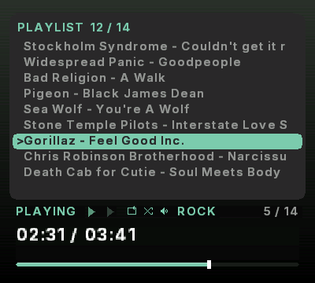

# MP3 Player — Analogue Pocket

A music player for the Analogue Pocket. It plays MP3 and FLAC straight off the
SD card, with album art, tags and meters.

Decoding runs in software, on a RISC-V CPU built into the Pocket's FPGA.

Current version **v1.5.1**. Release history: [CHANGELOG.md](CHANGELOG.md).

## Installing

Copy the `Cores`, `Platforms` and `Assets` folders onto the root of your
Pocket's SD card, merging with what's already there. Then drop your `.mp3` and
`.flac` files into:

```text
/Assets/mp3player/common/
```

They can live in subfolders under that path — an `Artist/Album` layout works
without rearranging. `mp3player.rom` is the firmware and has to stay in that
folder — the core won't start without it. `mp3font.bin` sits beside it and
carries the Japanese and accented characters; without it those titles fall back
to `?`, and everything else still works.

## Playing

At launch the core loads **`playlist.m3u`** — that name specifically, not any
playlist it finds. Choose a different one with **Load Playlist** and it becomes
the one that loads from then on. With nothing to load you get a getting-started
screen; press **Analogue** and choose **Load MP3** or **Load Playlist**, which
you can do at any time.

The controls:

| Pocket | Action |
|---|---|
| **A** | *Tap* — play / pause |
| **A** | *Hold* — 1.2× speed; hold again for normal |
| **Start** | Stop — returns to 0:00 |
| **Left** / **Right** | *Tap* — previous / next track |
| **Left** / **Right** | *Hold* — seek, faster the longer you hold |
| **Select** + **Left** / **Right** | Seek one second |
| **Up** / **Down** | Volume, in 5% steps |
| **B** | Restart the current track from the beginning |
| **X** | Cycle the meter (twelve styles) |
| **Y** | Cycle the EQ preset (eight) |
| **Select** | *Tap* — playlist browser; *Hold* — show / hide the album art panel |
| **L** / **R** | Cycle the accent color (12 shades) |
| **Select** + **L** | Repeat: off → all → one |
| **Select** + **R** | Shuffle on / off |
| **Select** + **Down** | Screen blank: off → 1 → 5 → 10 → 30 min |

Track changes and seeking work while paused or stopped. Changing track takes a
moment — the file has to be opened, its tag read and its artwork decoded;
restarting the current one is instant.

Volume, accent color, repeat, shuffle, the meter and the EQ preset carry over
between sessions, in step with **Core Settings**; the album art panel and
screen-blank timeout reset each launch. Switch on **Resume playback** there and
the core also remembers where you were — one place, for the last playlist you
used. **Load MP3** records no position, so for an audiobook use a playlist; a
one-line `.m3u` is enough.

Saved settings live in `/Settings/HarpMudd.Mp3Player/` — delete that folder to
reset. Nothing is written to your music folder.

## Languages

Titles, artists and filenames display in most of the world's widely used
scripts, in the player and in the playlist browser alike — 22,800 characters,
checked against real text rather than a list of ranges:

| | |
|---|---|
| **Japanese** | Kanji, hiragana, katakana, fullwidth forms, 「」、。 |
| **Chinese** | Simplified and Traditional |
| **Western European** | English, French, German, Spanish, Portuguese, Italian, Dutch, Nordic — é è ê ü ö ñ ç ß å ø æ |
| **Central and Eastern European** | Polish, Czech, Slovak, Hungarian, Croatian, Slovenian, Turkish, Latvian, Lithuanian, Estonian |
| **Greek** | Ελληνικά |
| **Cyrillic** | Russian, Ukrainian, Bulgarian, Serbian, Belarusian, Macedonian |
| **Punctuation and symbols** | Curly quotes, dashes, ellipsis, € ™ °, ♪ ♫ ★ ♥ → ● ■ ½ ± |

Accented capitals keep their accents — Édith, Ólafur, ŠKODA — which a 16-pixel
line normally clips. Tags are read as UTF-8 or UTF-16, whichever the file uses,
and filenames work too, so an untagged file still reads as itself. The
characters come from `mp3font.bin`, which the core loads at startup.

## What it shows


- **Title and artist** from the file's tag. One with no readable tag shows its
  filename, which is usually the song name anyway.
- **Album art** from the tag's embedded image — baseline JPEG. Tracks without a
  cover show no panel; a cover that can't be decoded shows the panel with the
  reason in it.
- **Twelve meters**, cycled with **X**: bars, waterfall, L/R levels, phase
  scope, oscilloscope, twin analogue VU needles, scrolling waveform, mirrored
  bars, peak dots, a magic eye, a 16-band spectrum analyser and an animated
  cassette whose reels wind as the track plays.
- **Elapsed and total time**, with a progress bar.
- **Repeat and shuffle indicators**, dimmed rather than hidden when off, the
  **EQ preset name**, and the position in the playlist.
- **Bitrate and sample rate**, with the encoder that made the file where it
  says so — `128 kbps - 44.1 kHz - LAME3.100`.

Tapping **Select** replaces this screen with the
[playlist browser](#the-playlist-browser) until you close it.

CBR and VBR **MPEG-1 and MPEG-2** Layer III at every standard bitrate and sample
rate, mono or stereo, plus FLAC — see [below](#flac). MPEG-2 covers the lower
sample rates common in spoken-word recordings.<br clear="right">

## Playlists

A plain text file with one track per line, saved as `playlist.m3u` in
`/Assets/mp3player/common/`:

```text
Feel Good Inc.mp3
Rhinestone Eyes.mp3
Demon Days/01 Intro.mp3
```

Names are relative to the folder the playlist is in, so a playlist can sit
beside its tracks in an album folder or in `common/` naming tracks below it.
Either works, so an `Artist/Album` library needs no rearranging. Lines starting
with `#` are ignored, so exported playlists work as-is.

Any other filename is picked with **Load Playlist**, and becomes the one that
loads at launch from then on — provided its name is short enough to be
remembered.

### The playlist browser



**Tap Select** to browse the playlist on screen. It opens on the track that's
playing, so you always start from where you are. The transport row, the times
and the progress bar stay put underneath, so nothing about what's playing is
hidden while you look.

| Pocket | Action |
|---|---|
| **Up** / **Down** | Move the cursor — hold to run through a long list |
| **Left** / **Right** | Page up / down a screenful at a time |
| **Y** | Jump back to the track that's playing |
| **A** | Play whatever's under the cursor |
| **Select** or **B** | Close without changing anything |

Rows show filenames rather than tags — a tag lives inside its file, so naming
every row would mean opening all 256 of them. With shuffle on, the list is the
play queue, so scrolling down shows what's actually coming rather than the file
order.<br clear="right">

### Limits

| | Limit | What happens past it |
| --- | --- | --- |
| Tracks per playlist | 256 | Says how many were dropped |
| `.m3u` file size | 12 KB | Same — about 48 characters per line at 256 tracks |
| Remembered playlist name | any length, if listed in `playlists.m3u` — otherwise 12 characters | Falls back to `playlist.m3u` next launch |

### Remembering which playlist you were using

The core reopens the list you last used. It remembers the name in twelve
characters, so `Shenanigans.m3u` comes back on its own and
`Goose - Shenanigans Nite Club.m3u` does not.

**List a playlist in `playlists.m3u` and the limit goes away** — a plain list of
playlist names, saved beside them in `/Assets/mp3player/common/`:

```text
Crash Test Dummies - God Shuffled His Feet.m3u
Goose - Shenanigans Nite Club.m3u
Live/Phish - Hampton 1997.m3u
```

Only listed playlists are remembered; order doesn't matter. Without the file,
short names still work as they always did.

Resume finds your place through that same playlist, so if the playlist can't be
reopened it starts at the beginning of `playlist.m3u`.

Tracks advance automatically. **Repeat**: off stops at the end, *all* loops,
*one* repeats the current track. **Shuffle** plays in a random order and never
repeats a track until the rest have played; with **Repeat all**, each pass round
the list is freshly shuffled.

A misspelled or missing filename costs that one track — the core steps over it
and says how many it skipped.

## Equalizer

**Y** cycles eight presets. The current one is named in the mode row, dimmed
on `FLAT`.

| | |
|---|---|
| **FLAT** | true bypass — bit-identical to no EQ at all |
| **BASS** | low shelf lift, gentle upper-mid dip |
| **ROCK** | smile curve — lows and highs up, mids back |
| **POP** | presence lift around 2–4 kHz |
| **JAZZ** | warm lows, relaxed upper-mid |
| **CLASSICAL** | gentle warmth, honest mids, eased upper mids, air |
| **VOCAL** | mid forward, lows trimmed |
| **TREBLE** | high shelf lift |

Presets are loudness-matched, so switching changes the tone without changing how
loud the music seems.

## Playback speed

Hold **A** for 1.2×, hold again for normal. It's meant for spoken word: pitch
rises with the speed, so music sounds wrong. Off every launch. 1.2× is the
whole range — double speed would mean decoding twice as many frames a second,
past what the CPU can do.

## Screen blanking

**Select + Down** cycles the timeout: off, 1, 5, 10, 30 minutes. The screen
goes black after that long without a button press, and any button wakes it
without doing anything else — reaching for a sleeping player shouldn't pause
it. Playback carries on regardless. Resets to off each launch, and it blacks
the picture rather than powering down: a core can't reach the Pocket's
backlight, so it's for a dark room, not for battery.

## FLAC

Drop `.flac` files in with everything else and they play the same way — tags,
album art, meters, seeking.

| | supported |
|---|---|
| Sample rate | up to **48 kHz** |
| Bit depth | 8, 16, 20 and 24-bit |
| Channels | mono and stereo |

That covers CD rips and most libraries. Hi-res — 88.2, 96, 176.4 and 192 kHz —
is out, along with 32-bit and multichannel. Anything the core can't play says
so on screen and names the file's own format, so you aren't left guessing.

The limit is the CPU, not a setting: a 24-bit 44.1 kHz track already uses about
80% of the time available, and the same music at 96 kHz needs nearly twice what
the chip can do. Converting a hi-res album to 44.1 kHz is still lossless, and
on headphones from a handheld it isn't a difference you're going to hear.

## How it works

There's no audio decoder chip in the Pocket, so the FPGA is loaded with a
RISC-V CPU and the decoders run on it as software, with the audio queue and the
equalizer built as hardware around it.

If that sounds interesting, the longer version — including the two Analogue
framework bugs that had to be found first — is in
[docs/HOW_IT_WORKS.md](docs/HOW_IT_WORKS.md).

## Known limitations

- **FLAC up to 48 kHz.** Hi-res files are turned away with the reason on
  screen; see [FLAC](#flac) for why, and what to convert them to.
- **Baseline JPEG album art only.** A progressive JPEG shows **PROG. JPEG**,
  anything else that won't decode shows **COVER ERROR**, and re-saving the
  cover as a baseline JPEG fixes both. A track with no cover simply shows no
  panel.
- **Playlists are capped at 256 tracks**, or 12 KB of `.m3u` text — whichever
  comes first, which allows about 48 characters per line. A playlist that runs
  past either says so instead of quietly playing fewer.
- **A playlist named longer than 12 characters needs a `playlists.m3u` entry
  to be remembered** — see
  [Remembering which playlist you were using](#remembering-which-playlist-you-were-using).
  It plays fine either way.
- **The most demanding FLAC files can still stutter** — 24-bit at a high
  bitrate, mainly. Decoding runs on a CPU inside the FPGA and those files ask
  for nearly all of it, leaving little for the screen and the card.

  Two things help, in order of effort. **Switch to a simpler meter** — the
  magic eye, the cassette and the 16-band spectrum are the most demanding of
  the twelve, and on a file that is close to the edge that alone can be the
  difference. Bars is among the cheapest. Failing that, re-encode at the
  default compression setting or to 16-bit/44.1 kHz.
- **Japanese tags written in Shift-JIS come out wrong.** Modern taggers write
  UTF-8 or UTF-16 and display correctly; Shift-JIS is what older rips often
  carry, and converting it needs a lookup table the firmware has no room for.
  Re-saving the tags as UTF-8 fixes it.
- **1.2× speed can distort in dense passages.** It needs up to 54.8 MHz of the
  60 available, so the decoder occasionally can't keep up. Normal speed is
  unaffected.

## Credits

This core stands on other people's work. Where code is included, the name comes
from that source file's own copyright header.

- **[Helix MP3 decoder](https://github.com/ultraembedded/libhelix-mp3)** —
  © 1995–2002 [RealNetworks, Inc.](https://www.realnetworks.com), released to
  the [Helix Community](https://helixcommunity.org) under the
  [RPSL 1.0](https://helixcommunity.org/content/rpsl). Included in full, under
  its own license, unmodified.
- **[VexRiscv](https://github.com/SpinalHDL/VexRiscv)** soft CPU — Charles Papon
  ([Dolu1990](https://github.com/Dolu1990)) (MIT).
- **[picojpeg](https://github.com/richgel999/picojpeg)** — Rich Geldreich
  ([richgel999](https://github.com/richgel999)), with changes from Chris
  Phoenix (public domain).
- **SDRAM controller and i2s audio bridge** — Adam Gastineau
  ([agg23](https://github.com/agg23)) (MIT).
- **[Audio EQ Cookbook](https://www.w3.org/TR/audio-eq-cookbook/)** — Robert
  Bristow-Johnson. The equalizer's shelf and peaking filter formulas are his;
  the coefficients here are generated from them.
- **[openFPGA framework](https://www.analogue.co/developer)** —
  [Analogue](https://www.analogue.co).
- **[Inter typeface](https://rsms.me/inter/)** — Rasmus Andersson
  ([rsms](https://github.com/rsms)) — SIL Open Font License 1.1, bundled at
  [`third_party/font/OFL.txt`](third_party/font/OFL.txt). The font ROM the core
  draws with is generated from it and is a derivative under the same license.
- **[GNU Unifont](https://unifoundry.com/unifont/)** — Roman Czyborra, Paul
  Hardy and the Unifont contributors, dual licensed under the SIL Open Font
  License 1.1 and the GNU GPL 2+ with the font embedding exception, bundled at
  [`third_party/unifont/OFL-1.1.txt`](third_party/unifont/OFL-1.1.txt). Its
  Japanese variant supplies the kana, CJK ideographs and symbols in
  `mp3font.bin`, which is a derivative under the same license.
- **Core, firmware, UI and integration** —
  [HarpMudd](https://github.com/harpmudd).

Two more shaped the design without ending up in it. Both decided something, which
is why they are credited at all:

- **[minimp3](https://github.com/lieff/minimp3)** —
  [lieff](https://github.com/lieff) (CC0). Measured against Helix and rejected —
  over three times slower, because it is floating point and this CPU has no FPU.
  Its test vectors were the measurement input either way.
- **[PicoRV32](https://github.com/YosysHQ/picorv32)** — Claire Xenia Wolf
  ([clairexen](https://github.com/clairexen)) (ISC). The first CPU tried. It
  needed 114–351 MHz to decode in real time depending on configuration, which is
  what sent the design to VexRiscv.

## License

The code written for this project — the firmware, the RTL, the tools and the
docs — is [MIT licensed](LICENSE).

Everything under `third_party/` keeps its own, and MIT here relicenses none of
it. Two carry real obligations:
[Helix](third_party/libhelix-mp3/docs/RPSL.txt) is RPSL 1.0, a per-file
source-disclosure license, so it is vendored in full and unmodified;
[Inter](third_party/font/OFL.txt) is SIL OFL 1.1, and the font ROM generated
from it is a derivative under the same terms. The rest are MIT, ISC or public
domain — see [Credits](#credits).

## About / Support

I'm into retro games and the Analogue Pocket, always cooking up something new.
I love being part of a community built on sharing and the love of games — so if
any of my projects bring you joy, chip in below; it fuels the next thing.

💛 **[Support this project via PayPal](https://www.paypal.com/donate/?hosted_button_id=S22WV924XU2ME)**
