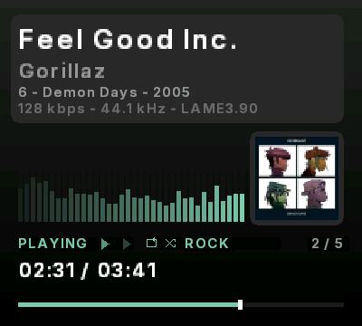

# MP3 Player — Analogue Pocket

An MP3 player for the Analogue Pocket. Pick a track or a playlist and the core
decodes and plays it straight off the SD card, with album art, ID3 tags, nine
switchable meters, an eight-preset equalizer and a progress bar.

Decoding runs in software, on a RISC-V CPU built into the Pocket's FPGA.

## Installing

Copy the `Cores`, `Platforms` and `Assets` folders onto the root of your
Pocket's SD card, merging with what's already there. Then drop your `.mp3`
files into:

```text
/Assets/mp3player/common/
```

They can live anywhere on the card; keeping them there makes them quick to find
in the browser.

`mp3player.rom` is the firmware — the core won't start without it. That, your
music and a `playlist.m3u` if you want one are all that belong there.

## Playing

If a playlist is on the card, the core loads its first track at launch and waits
— press **A** to play.

Otherwise press **Analogue** and choose **Load MP3** or **Load Playlist**. The
same menu switches either at any time.

| Pocket | Action |
|---|---|
| **A** | Play / pause |
| **Start** | Stop — returns to 0:00 |
| **Left** / **Right** | *Tap* — previous / next track |
| **Left** / **Right** | *Hold* — seek back / forward |
| **Up** / **Down** | Volume, in 5% steps |
| **B** | Restart the current track from the beginning |
| **X** | Cycle the meter (nine styles) |
| **Y** | Cycle the EQ preset (eight) |
| **Select** | Show / hide the album art panel |
| **L** / **R** | Cycle the accent color (12 shades) |
| **Select** + **L** | Repeat: off → all → one |
| **Select** + **R** | Shuffle on / off |

Track changes and seeking work while paused or stopped. Changing track takes a
moment — the file has to be opened, its tag read and its artwork decoded;
restarting the current one is instant.

Volume, accent color, repeat, shuffle, the meter, the art panel and the EQ
preset are remembered between sessions, and the controls and **Core Settings**
stay in step. Playback position is not — every launch starts a track from the
beginning. The Pocket keeps the settings under `/Settings/HarpMudd.Mp3Player/`
on the card; delete that folder to reset. Nothing is written to your music
folder.

## Equalizer

**Y** cycles eight presets. The current one is named in the mode row, dimmed
on `FLAT`.

| | |
|---|---|
| **FLAT** | true bypass — bit-identical to no EQ at all |
| **BASS** | low shelf lift, gentle upper-mid dip |
| **ROCK** | smile curve — lows and highs up, mids back |
| **POP** | presence lift around 2–4 kHz |
| **JAZZ** | warm lows, relaxed upper-mid |
| **CLASSICAL** | gentle warmth, honest mids, eased upper mids, air |
| **VOCAL** | mid forward, lows trimmed |
| **TREBLE** | high shelf lift |

It works while paused; there is just nothing to hear until you press play.

Presets are loudness-matched, so switching changes the tone without changing how
loud the music seems.

## Playlists

Make a plain text file with one track per line and save it as `playlist.m3u` in
`/Assets/mp3player/common/`:

```text
Feel Good Inc.mp3
Rhinestone Eyes.mp3
/Music/Albums/Demon Days/01 Intro.mp3
```

Bare names are relative to that folder; a leading `/` is from the card root.
Lines starting with `#` are ignored, so exported playlists work as-is.

`playlist.m3u` loads at boot; any other name loads from **Load Playlist**.

Tracks advance automatically. **Repeat**: off stops at the end, *all* loops,
*one* repeats the current track. **Shuffle** plays in a random order and never
repeats a track until the rest have played; with **Repeat all**, each pass round
the list is freshly shuffled.

A misspelled or missing filename costs that one track — the core steps over it
and says how many it skipped. The count on screen is what will actually play,
not how many lines the file has.

## What it shows



- **Title and artist** from the ID3v2 tag.
- **Album art** from the tag's embedded image — JPEG only; tracks without it
  don't show the panel.
- **Nine meters**, cycled with **X**: bars, waterfall, L/R levels, phase scope,
  oscilloscope, twin analogue VU needles, scrolling waveform, mirrored bars and
  peak dots.
- **Elapsed and total time**, with a progress bar.
- **Repeat and shuffle indicators**, dimmed rather than hidden when off, the
  **EQ preset name**, and the position in the playlist.
- **The encoder that made the file**, beside the bitrate and sample rate —
  `128 kbps - 44.1 kHz - LAME3.100`. Files without a LAME tag just show the
  format.

CBR and VBR MPEG-1 Layer III at every standard bitrate and sample rate, mono or
stereo.<br clear="right">

## How it works

There's no MP3 decoder chip in the Pocket, so the FPGA is loaded with a RISC-V
CPU and the decoder runs on it as software, with the audio queue and the
equalizer built as hardware around it.

If that sounds interesting, the longer version — including the two Analogue
framework bugs that had to be found first — is in
[docs/HOW_IT_WORKS.md](docs/HOW_IT_WORKS.md).

## Known limitations

- **Total time is estimated** on files with no Xing/Info/VBRI header — exact
  for CBR, approximate for VBR.
- **MPEG-1 Layer III only.** MPEG-2/2.5 and Layer I/II are not handled.
- **JPEG album art only.** PNG covers are skipped rather than shown wrong —
  see [ROADMAP.md](ROADMAP.md).
- **Playlists are capped at 128 tracks**, and the file itself at 8 KB.
- **No spectrum display.** The decoder doesn't expose frequency bins, so the
  meters show loudness, waveform and stereo instead.

## Credits

This core stands on other people's work. Where code is included, the name comes
from that source file's own copyright header.

- **[Helix MP3 decoder](https://github.com/ultraembedded/libhelix-mp3)** —
  © 1995–2002 [RealNetworks, Inc.](https://www.realnetworks.com), released to
  the [Helix Community](https://helixcommunity.org) under the
  [RPSL 1.0](https://helixcommunity.org/content/rpsl). Included in full, under
  its own license, unmodified.
- **[VexRiscv](https://github.com/SpinalHDL/VexRiscv)** soft CPU — Charles Papon
  ([Dolu1990](https://github.com/Dolu1990)) (MIT).
- **[picojpeg](https://github.com/richgel999/picojpeg)** — Rich Geldreich
  ([richgel999](https://github.com/richgel999)) (public domain).
- **SDRAM controller and i2s audio bridge** — Adam Gastineau
  ([agg23](https://github.com/agg23)) (MIT).
- **[Audio EQ Cookbook](https://www.w3.org/TR/audio-eq-cookbook/)** — Robert
  Bristow-Johnson. The equalizer's shelf and peaking filter formulas are his;
  the coefficients here are generated from them.
- **[openFPGA framework](https://www.analogue.co/developer)** —
  [Analogue](https://www.analogue.co).
- **[Inter typeface](https://rsms.me/inter/)** — Rasmus Andersson
  ([rsms](https://github.com/rsms)) — SIL Open Font License 1.1, bundled at
  [`third_party/font/OFL.txt`](third_party/font/OFL.txt). The font ROM the core
  draws with is generated from it and is a derivative under the same license.
- **Core, firmware, UI and integration** —
  [HarpMudd](https://github.com/harpmudd).

Two more shaped the design without ending up in it. Both decided something, which
is why they are credited at all:

- **[minimp3](https://github.com/lieff/minimp3)** —
  [lieff](https://github.com/lieff) (CC0). Measured against Helix and rejected —
  over three times slower, because it is floating point and this CPU has no FPU.
  Its test vectors were the measurement input either way.
- **[PicoRV32](https://github.com/YosysHQ/picorv32)** — Claire Xenia Wolf
  ([clairexen](https://github.com/clairexen)) (ISC). The first CPU tried. It
  needed 114–351 MHz to decode in real time depending on configuration, which is
  what sent the design to VexRiscv.

## License

The code written for this project — the firmware, the RTL, the tools and the
docs — is [MIT licensed](LICENSE).

Everything under `third_party/` keeps its own, and MIT here relicenses none of
it. Two carry real obligations:
[Helix](third_party/libhelix-mp3/docs/RPSL.txt) is RPSL 1.0, a per-file
source-disclosure license, so it is vendored in full and unmodified;
[Inter](third_party/font/OFL.txt) is SIL OFL 1.1, and the font ROM generated
from it is a derivative under the same terms. The rest are MIT, ISC or public
domain — see [Credits](#credits).

## About / Support

I'm into retro games and the Analogue Pocket, always cooking up something new.
I love being part of a community built on sharing and the love of games — so if
any of my projects bring you joy, grab me a coffee; it fuels the next thing.

☕ **[buymeacoffee.com/harpmudd](https://buymeacoffee.com/harpmudd)**
